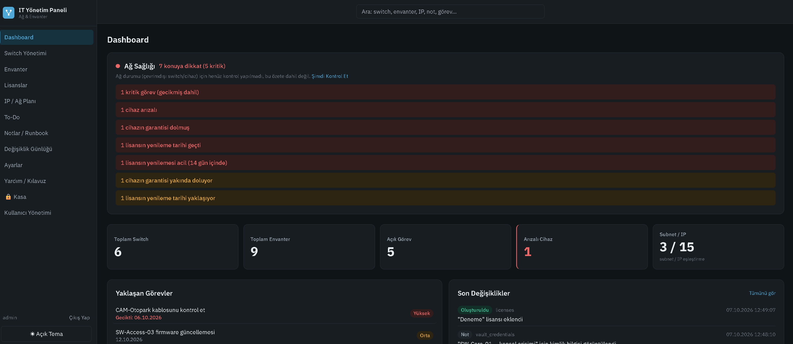
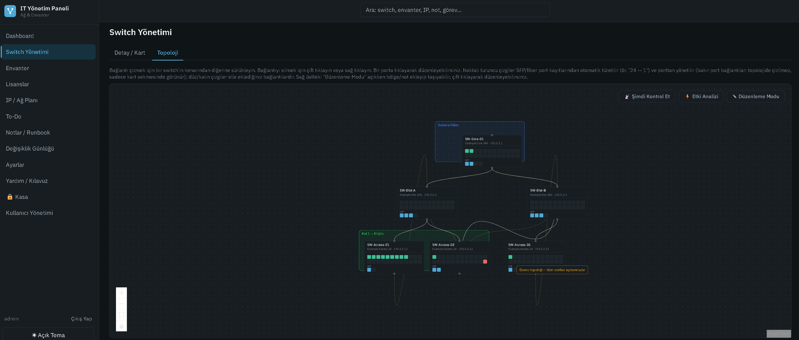
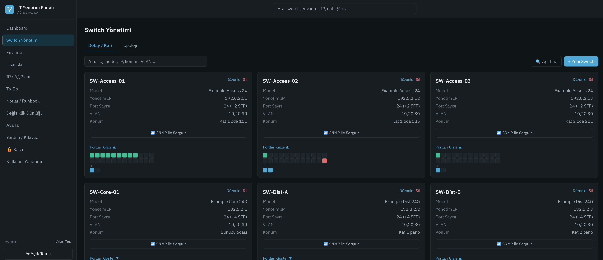
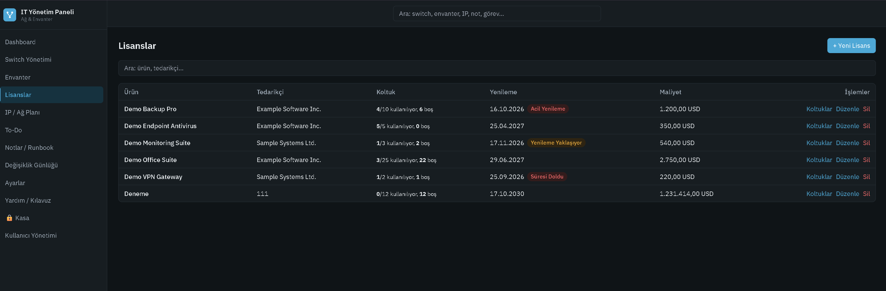
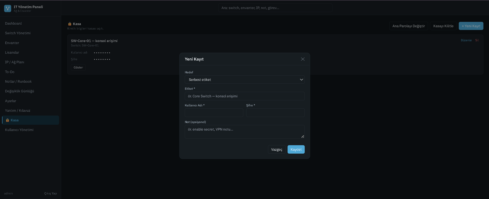
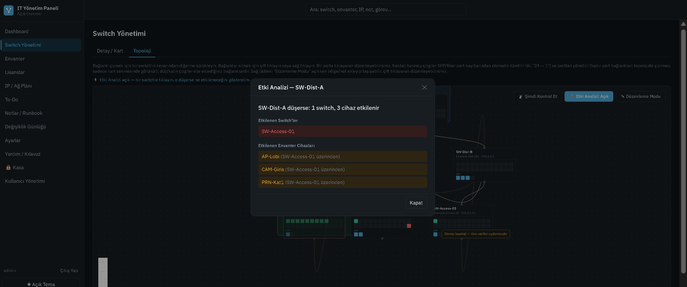

# IT Yönetim Paneli

Küçük ve orta ölçekli ağlar için kendi sunucunuzda çalışan, **sıfır native bağımlılıklı** bir IT envanter ve ağ
yönetim paneli: switch/port haritası, canlı topoloji, IP planı, donanım envanteri, yazılım lisansları, şifreli kimlik
kasası, SNMP keşfi ve etki analizi. Arayüz Türkçedir.

> Ekran görüntüleri `docs/screenshots/` altına eklenecek (aşağıdaki yer tutucular).

| | |
|---|---|
|  |  |
|  |  |
|  |  |

## Özellikler

- **Dashboard & ağ sağlığı:** çevrimdışı cihazlar, arızalı envanter, garanti ve lisans yenileme uyarıları tek özette.
- **Switch yönetimi:** port bazlı doluluk (bakır + SFP), uplink/bağlantı takibi, VLAN, sürükle-bırak **topoloji**
  (bölge/metin/şekil açıklamaları), omurga işaretleme.
- **Etki analizi:** "Bu switch düşerse kim etkilenir?" — yedekli yolları da hesaba katar.
- **SNMP v2c:** tekil switch sorgusu ve CIDR/aralık **ağ taraması** (bulunanlar onayla eklenir).
- **Envanter:** durum, garanti takibi, dosya ekleri, CSV dışa aktarma, toplu işlemler.
- **IP / ağ planı:** subnet'ler, VLAN'lar, IP havuzu doluluk/boş özeti.
- **Lisanslar:** koltuk kullanımı, yenileme rozetleri (≤14 gün acil, ≤60 gün yaklaşan), fatura ekleme, **şifreli lisans anahtarı**.
- **Kimlik kasası:** ana parola ile AES-256-GCM şifreli cihaz giriş bilgileri.
- **To-Do (kanban), notlar/runbook (Markdown), değişiklik günlüğü, global arama.**
- **Yedekleme:** JSON dışa/içe aktarma, otomatik güvenlik yedeği, transaction'lı geri yükleme.
- **Kullanıcı yönetimi** (admin/user), oturum tabanlı kimlik doğrulama, brute-force koruması.
- **Masaüstü uygulaması** (Electron, Windows NSIS kurulum / portable).

Mimari ayrıntılar için: [ARCHITECTURE.md](ARCHITECTURE.md).

## Gereksinimler

- Node.js **22.5+** (yerleşik `node:sqlite` için; 24 ile test edildi). Derleme araç zinciri/native modül gerekmez.

## Kurulum ve çalıştırma

### Geliştirme (dev)

```bash
npm run install:all
npm run dev
```

Client http://localhost:5173 (Vite, `/api`'yi 4000'e proxy'ler), server http://localhost:4000. Tarayıcıda **5173** açılır.
İlk açılışta kullanıcı yoksa **"İlk Admin Hesabı Oluştur"** ekranı gelir.

### Production (tek port)

```bash
npm run build
npm start          # http://localhost:4000
```

Windows'ta kod bilmeden başlatmak için `start.bat` (gerekirse ilk seferde derler, sonra sunucuyu başlatıp tarayıcıyı açar).

### Masaüstü (Electron)

```bash
npm run electron   # derler, sunucuyu aynı process'te başlatıp kendi penceresinde açar
npm run dist:win   # release/ altında NSIS Setup .exe + portable üretir
```

Paketli uygulama verisini `%AppData%\it-panel\data\` altında tutar, Node.js kurulu olması gerekmez. İmzasız
olduğu için Windows SmartScreen ilk çalıştırmada uyarır ("Ek bilgi → Yine de çalıştır"). Portable sürüm bazı
kısıtlı/otomasyon ortamlarında test edilemedi; önerilen dağıtım Setup `.exe`'dir.

### Ortam değişkenleri

| Değişken | Varsayılan | Açıklama |
|---|---|---|
| `PORT` | `4000` | Sunucu portu. |
| `DATA_DIR` | *(yok)* | Verilirse veri `<DATA_DIR>/data/` altına yazılır. Yoksa proje kökündeki `data/`. |
| `COOKIE_SECURE` | `false` | `true` ise oturum çerezi yalnız HTTPS'te gönderilir. |

### Veri konumu

- Veritabanı: `data/app.db`, yüklenen dosyalar: `data/uploads/`, otomatik güvenlik yedekleri: `data/auto-backup-*.json`.
- `data/` klasörünün **içeriği repoya girmez** (`.gitignore`); klasör `.gitkeep` ile boş durur.

## Demo veri (yalnızca demo)

Gerçek veriniz olmadan denemek veya ekran görüntüsü almak için tamamen uydurma bir demo veritabanı üretin
(6 switch + portlar/uplink'ler, envanter, `192.0.2.0/24`, `198.51.100.0/24`, `203.0.113.0/24` dokümantasyon
IP'leri, 5 lisans, notlar, kanban görevleri, topoloji açıklamaları, örnek kasa kaydı).

```bash
npm run seed:demo          # ./demo-data/data/app.db üretir (gerçek data/'ya ASLA yazmaz)
```

Çıktıdaki komutla demo veriyle başlatın (proje kökünden, **mutlak yol** kullanın):

```powershell
$env:DATA_DIR = "$PWD\demo-data"; npm run dev          # PowerShell
```
```bash
DATA_DIR="$PWD/demo-data" npm run dev                  # bash
```

> **YALNIZCA DEMO** — herkese açık, bilinen kimlik bilgileri:
> kullanıcı **`admin`** / parola **`demo-admin-1234`**, kasa ana parolası **`demo-kasa-1234`**.
> Bunları gerçek bir kurulumda asla kullanmayın.

Seed script'i hedef klasör gerçek `data/` (veya proje kökü / içi) ise hata verip durur; demo veritabanı doluysa
yeniden üretmek için `demo-data/` klasörünü silin. Demo veride: SW-Dist-A düşerse SW-Access-02 yedekli yol sayesinde
etkilenmez; bir lisansın yenilemesi 14 günden az, biri 60 günden az, biri geçmiş, biri tam dolu koltukludur.

## Güvenlik notları

- Parolalar scrypt ile hash'lenir; oturumlar sunucu tarafındadır; 5 hatalı girişte hesap 5 dk kilitlenir.
- Kasa ana parolası **kurtarılamaz**; parola ve türetilen anahtar diske yazılmaz. Kasa, sayfadan çıkınca,
  sekme kapanınca ve 5 dk işlemsizlikte kilitlenir.
- Yedek dosyalarında kasa ve lisans anahtarları **şifreli** gelir; yine de yedekleri gizli tutun (çevrimdışı
  brute-force riski, ana parolanızın gücüne bağlıdır).
- SNMP community string'leri veritabanında düz metindir, API yanıtlarında dönmez.
- **İnternete açmadan önce:** CORS'u daraltın, HTTPS arkasına alın ve `COOKIE_SECURE=true` yapın. Uygulama
  varsayılan olarak yerel/dahili ağ kullanımı için tasarlanmıştır. Gerçek ağ verisini herkese açık bir demo ortamına taşımayın.

## Yol haritası

- [ ] LLDP/CDP ile komşu keşfi (bağlantıları otomatik çıkarma)
- [ ] SNMP ile port durumu / trafik izleme (up/down, hız) ve topolojiye yansıtma
- [ ] CSV içe aktarma (envanter, IP planı, lisanslar)
- [ ] Rol bazlı yetkilendirme (kasa için ince ayar), SNMP v3
- [ ] Bildirimler (e-posta) — garanti/lisans yenileme hatırlatıcıları

## Geliştirme

```bash
npm test --prefix server                 # birim testler (kripto, parola gücü, etki analizi)
(cd server && npx tsc --noEmit) && (cd client && npx tsc --noEmit)   # tip kontrolü
```

## Lisans

[MIT](LICENSE)
